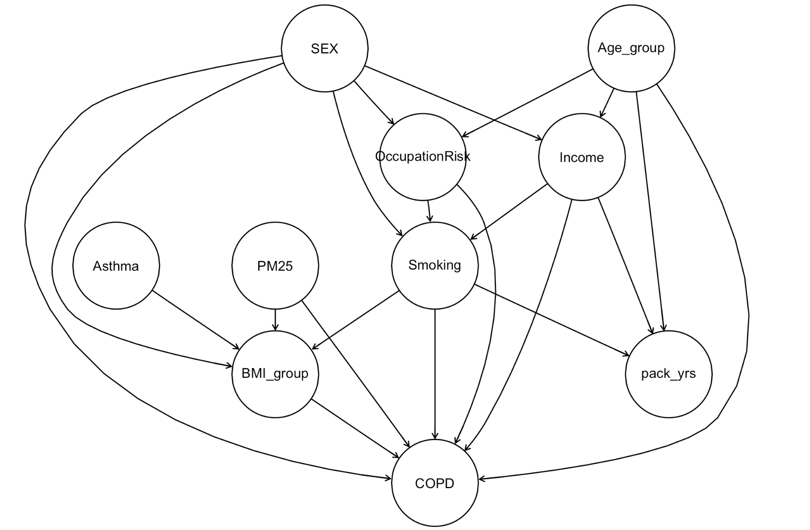

# Hybrid Bayesian Network for Early COPD Screening — Portfolio Highlight

**TL;DR (3 lines).**
- **Generative models like BN** capture causal structure but underperform in prediction. **Discriminative models like LR** excel at prediction but lack interpretability.
- I built a **Hybrid BN (BN-H)** that keeps BN’s graph but replaces the COPD node’s CPT with an LR trained on its parents.
- Result: **BN-H matches LR’s performance** (F1 ↑, PR-AUC ↑) while preserving BN’s causal transparency (see Fig. 1 & Table 1).

---

### Figure 1 — Learned causal structure (BN)
*BN captures the relationships among risk factors and COPD. BN-H uses **the same graph**, swapping only the COPD node’s conditional table with LR probabilities.*

> ### Figure 1 — Learned causal structure (BN)

*BN captures the probabilistic relationships among risk factors and COPD. In BN-H, only the conditional distribution (CPT) of the target node (COPD) is replaced with **LR-predicted probabilities**, keeping the rest of the BN structure untouched.*
---

### Table 1 — Model comparison (test set)

| Model                       | AUC-ROC | PR-AUC | Accuracy | Recall | Precision | F1 |
|----------------------------|:-------:|:------:|:--------:|:------:|:---------:|:--:|
| **BN (vanilla; BN-WB)**    | 0.5882  | 0.2046 | 0.6500   | 0.5190 | 0.1925    | 0.2808 |
| **Hybrid BN (BN-H; proposed)** | **0.7058** | **0.2461** | 0.6667   | **0.6456** | 0.2287    | **0.3377** |
| **Logistic Regression**    | 0.7096  | 0.2455 | 0.6683   | 0.6456 | 0.2297    | 0.3389 |

**What stands out**
- **Recall:** 0.468→**0.646** (vs. vanilla BN) — clinically meaningful lift on positives.
- **PR-AUC:** 0.2046→**0.2461** — better ranking under class imbalance.
- **F1:** 0.254→**0.338** — nearly LR level, with BN’s causal transparency kept.

---

### How BN-H is constructed (one paragraph)
Start from the learned BN (with whitelist/blacklist domain constraints). Keep **all parents of the COPD node** and the **graph unchanged**. Train a **logistic regression** for COPD on that parent set and **use its predicted conditional probabilities** to replace the COPD node’s CPT. All other CPTs remain BN-based. Class imbalance in training is handled with **ADASYN** to avoid recall collapse.

---

### One-sentence pitch
**Hybrid BN = BN’s interpretability + LR’s predictive power** — a simple swap at the target node that measurably boosts PR-AUC/Recall without losing the causal story.

